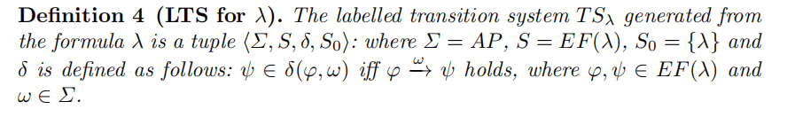
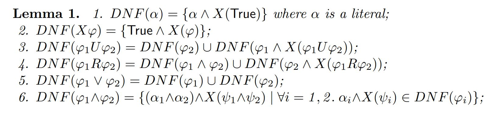
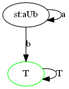
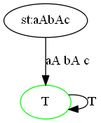
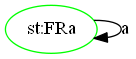
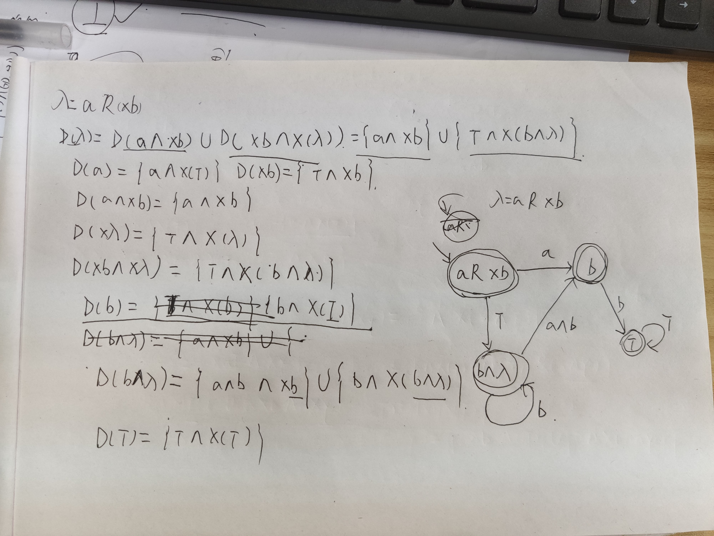

# 项目总结

## 写在前面

### 小组成员
1. 金鹏&nbsp;&nbsp;&nbsp;&nbsp;: 51194501007
2. 张小禹: 51194501082
3. 王献辉: 51194501181
4. 肖思慧: 51194501189

### 项目相关
助教/老师，您好!

我们项目的`github`地址为:[https://github.com/Callmejp/LTL2Buchi](https://github.com/Callmejp/LTL2Buchi)。这个页面可以看到相关的安装事宜。

另外，为了不耽误您的时间，这个链接[https://www.bilibili.com/video/av81034357/](https://www.bilibili.com/video/av81034357/)是我们上传的程序演示视频。

最后，打印的项目总结不能展示所有的效果。可以到[https://callmejp.github.io/2019/12/28/LTL-NBA/](https://callmejp.github.io/2019/12/28/LTL-NBA/)查看在线的文档。

## 1. 项目背景（需求分析）

随着计算机的发展，各类工业系统广泛应用在各行各业，验证这些系统的正确性尤为重要，特别是一些关键领域如航天航空、轨道交通等，一旦出现错误可能造成非常严重的后果。模型检测是一种很重要的自动验证技术，它可以自动执行，并能在系统不满足性质时提供反例路径，因此在工业界非常受推崇。

关于线性时态逻辑公式(Linear Temporal Logic, LTL)转换成等价自动机（通常是Bϋchi自动机）的研究已经进行了将近三十年。这种转换是基于自动机的模型检验的关键。Gerth等人在《Simple on-the-fly automatic verifaction and Flavio Lerda》提出了一种将LTL公式转化为Bϋchi自动机的on-the-fly构造方法，即使只构造了部分属性自动机，也可以检测反例。

在《On the Relationship between LTL Normal Forms and Bϋchi Automata》一文中，作者提出了一种新的构造Bϋchi自动机的方法，利用了析取范式(disjuctive-normal forms,DNF)。对于任意LTL公式φ都有等价的DNF范式$\bigvee_i(\alpha_i \land X \varphi_i)$，其中$\alpha_i$是有限字的合取，且$\varphi_i$是LTL公式的合取。在文中提到，任意LTL公式都可以转换成等价的DNF范式，且$\bigvee_i(\alpha_i \land X \varphi_i)$可以用$\phi$来表示。任意LTL公式都可以构造标签迁移系统(labelled transition system,LTS)。

LTS是构造自动机的第一步.特别地，对于`Until/Release-Free`的LTL的公式，可以给LTS添加一组接收状态直接获得Bϋchi自动机。构造Bϋchi自动机最难的部分是确定是确定可接收状态集合。

本文利用析取范式，对于`Until/Release-Free`的LTL的公式，然后转换成与LTL公式等价的Bϋchi自动机。故本项目即为对其理论的具体实现。

## 2. 概要设计

### 2.1 基本概念

1. LTL公式的NNF形式：否定符号只出现在原子命题前面的LTL公式，且具有如下形式：
   
   $$
   \varphi ::= a | \lnot a | \varphi \land \varphi | \varphi \lor | \varphi | \varphi U \varphi | \varphi R \varphi | X \varphi
   $$
2. DNF形式：当一个公式可以用$\bigvee_i(\alpha_i \land X \varphi_i)$表示，这个公式就是析取范式（DNF），$\alpha_i$是有限的文字合取，并且$\bigvee_i(\alpha_i \land X \varphi_i)$也是一个文字，或者是一个Until，Next，或者Release公式。
3. LTS转移系统：DNF公式λ对应的LTS转移系统定义如下：
   
   

### 2.2 把LTL公式转成DNF公式

对于一个NNF LTL公式$\varphi$，我们使用论文中的引理1，递归地产生$\varphi$对应的DNF公式DNF($\varphi$):
 
递归完成后，我们就会得到NNF LTL公式$\varphi$对应的集合形式的DNF公式，集合里面的元素就是$\varphi := \bigvee_i(\alpha_i \land X \varphi_i)$里面的$(\alpha_i \land X \varphi_i)$.

另外，在这一步中，我们求出DNF($\varphi$)中每个$(\alpha_i \land X \varphi_i)$里面的$\varphi_i$对应的DNF($\varphi_i$)，并且对所有的$\varphi_i$也进行这个操作，直到所有的DNF形式都是之前求出来过的为止，这一步是为了方便后面自动机转移关系的求解。

### 2.3 求出DNF公式对应的LTS

我们根据转移系统LTS的定义来求出DNF($\varphi$)对应的转移系统LTS：

$\Sigma = 2^{AP}$ ：原子命题集合，其中AP包含了原子命题和原子命题的否定，这也是为什么我们原子命题的否定的原因，在这样的定义下，原子命题和它的否定是没有区别的。

$S = EF(\varphi)$ ：状态集合，其中EF($\varphi)$)是$\varphi)$加上前面循环求出的所有的DNF公式中每个$(\alpha_i \land X \varphi_i)$里面的$\varphi$的集合，并不只是DNF($\varphi)$)中每个$(\alpha_i \land X \varphi_i)$里面的$\varphi$的集合，还包括了DNF($\varphi$)及之后重复这个过程所求出的$\varphi$的集合。

$S = \{\varphi\}$ ：初始状态集合，里面只包括$\varphi$

$\delta(\varphi, \omega)$：转移关系，这是最关键的一步，对于每个状态来说，以$\varphi$为例，
DNF($\varphi$)中每个$(\alpha_i \land X \varphi_i)$，我们有$\delta(\varphi, \alpha_i) = \varphi_i$，对每个状态都是这样求出它的所有转移关系。在这一步，对每个状态，我们都要根据它的DNF公式来求解转移关系，这就是2.2节我们求出所有DNF公式的原因。

### 2.4 求解LTS对应的自动机

由定义5可知，LTL公式$\varphi$对应的自动机就是在LTS的基础上添加终止状态集合F得到的，若$\varphi$是`Release-free`公式(即$\varphi$中不出现R的公式)，则其终止状态集合$F={True}$；若$\varphi$是`Until-free`公式(即$\varphi$中不出现U的公式)，则其终止状态集合$F=S$，即所有的状态集合。

至此，整个求解LTL公式$\varphi$对应的自动机的过程结束。


## 3. 约定

**为了便于程序的输入输出，我们对于LTL的符号进行确认或改写。**

1. Next : X
2. Release : R
3. Until : U
4. /\ : A
5. \/ : O
6. atomic proposition: a~z
7. parentheses : ), (
8. True: T
9. False: F

**其中，论文中所考虑的是LTL公式的`NNF`形式，即所有的否定都会被压缩到`literal level`。因此，本项目不考虑否定符号。**

另外，`G`，即`Always`也在论文提及可用`Release`等价替换，就不在此赘述。

## 4. 思路分析

1. 拆分LTL公式
   
   

   如上图的引理所示，首先根据六条规则将LTL公式化为DNF的形式。显然需要在代码中使用递归的想法。
2. 建立有向边（转移）
   
   假设$\varphi=(a \land b \land X(\psi))$，则从$\varphi$通过`ab`指向$\psi$。以此类推建立从$\varphi$出发的边。
3. 循环操作
   
   另外，如果$\psi$是没有出现过的子公式，则需要进一步对其进行直至没有新的子公式出现。
4. 建立终止状态

   根据论文4.2的定义，分别根据公式为`Until-Free`还是`Release-Free`分别设定不同的终止状态。

## 5. 具体实现

1. 算法最为关键的核心就是LTL公式的拆分，核心思路是使用递归实现，源代码如下：
   
   ```python
   def convertToDNF(subformula, level):
    """
    @description: convert the LTL formula to the DNF form
    @param: 
        subformula{str}: LTL formula.
             level{int}: recurrent Level.
    @return: 
        dict: each object indicates the CNF clause.
    """
    # Termination
    if  len(subformula) == 1:
        if subformula == 'F':
            # special case for False
            return []
        return packageFormula(subformula, 'T')
    elif subformula[0] == 'X':
        # process the CNF in X()
        subformula = subformula[2:-1]
        posList = []
        pos = 0
        cnt = 0
        for t in subformula:
            if t == '(':
                cnt += 1
            elif t == ')':
                cnt -= 1
            elif t == 'O' and cnt == 0:
               posList.append(pos)
            pos += 1

        if len(posList) == 0: 
            return packageFormula('T', subformula[1:])
        else:
            posList.append(len(subformula))
            tempList = []
            st = 0
            for ed in posList:
                tempFormula = subformula[st:ed]
                tempList += packageFormula('T', tempFormula)
                st = ed + 1
            print("CNF occurs in the X:", tempList)
            return tempList
    
    
    left = 'left'
    operater = 'operater'
    right = 'right'
    rightIndex = 0
    # Process
    if subformula[0] != '(':
        if subformula[0].islower() or subformula[0] == 'T' or subformula[0] == 'F':
            left = subformula[0]
            operater = subformula[1]
            rightIndex = 2
    elif subformula[0] == '(':
        # (|left(1:pos)|)
        # 0|           |pos
        match = 1
        pos = 1
        for t in subformula[1:]:
            if t == ')':
                match -= 1
                if match == 0:
                    break
            elif t == '(':
                match += 1
            pos += 1
        left = subformula[1:pos]
        operater = subformula[pos+1]
        rightIndex = pos + 2
    else:
        print('Sth unexpected happened near Process!')
    # extract the right part
    if subformula[rightIndex] == '(':
        right = subformula[rightIndex+1:-1]
    else:
        right = subformula[rightIndex:]
    
    # choose the different action based on the operator
    if operater == 'A':
        ...
        return formulaList
    elif operater == 'R':
        t1 = convertToDNF('('+left+')A('+right+')', level+1)
        t2 = convertToDNF('('+right+')A(X('+subformula+'))', level+1)
        t3 = t1 + t2
    elif operater == 'U':
        ...
    elif operater == 'O':
        ...
   ```
   
   可以看到`Termination`注释下就是递归的返回条件：要么此时子公式已经被分解到原子命题的程度；要么就是`X`形式。**其中对于`X`形式我们还特别处理了其中可能存在的DNF形式。因为根据论文的内容`X`形式中不能含DNF形式。**

   同时`left`,`operator`和`right`三部分分别代表着LTL公式一般可以左部分，操作符和右部分。将其记录就可以带入下一层的递归计算。

   最后U和O的代码段与R段类似，故以省略号替代。

2. 第二关键的就是如何建立Buchi自动机，或者说有向图。代码实现如下：
   ```python
   q = Queue()
    q.put(testFormula)
    while not q.empty():
        currentFormula = q.get()
        listOfDNF = convertToDNF(currentFormula, 0)
        print(listOfDNF)
        cleanFormula(listOfDNF)
        print(listOfDNF)

        for ele in listOfDNF:
            newFormula = formulaToStr(ele['xFormula'])
            print("new Formula:", newFormula)
            if mapDict.get(newFormula, -1) == -1:
                q.put(newFormula)
                updateMap(newFormula)
                nodes.append(newFormula)
            
            newAtomic = atomicToStr(ele['atomic'])
            print("new Atomic", newAtomic)

            edges.append({'u': currentFormula, 'v': newFormula, 'label': newAtomic})
   ```
    可以比较直观地看出来就是常用的使用队列建立图的方法。其中我们需要判断生成的子公式是否原来出现过，否则会导致代码产生死循环。

3. 主要数据结构解析

   我们主要使用`python`中的`dictionary`数据类型保存LTL公式的每个`clause`。

   假设当前$\varphi = (a \land b \land X(c)) \lor ...$。则其对应的dict对象为:

   ```python
   [{'atomic': ['a', 'b'], 'xFormula': ['c']}, ...]
   ```

   最外层使用`list`进行包裹，方便程序实现合并操作。

## 6. 算法时间复杂度分析

整体算法分为2步：拆分LTL公式；建立Buchi自动机。但是这两步是在一个整体的循环中。具体可以参考如下的伪代码。
```
while 队列不为空
    取出新的子公式a
    拆分a
    if 有新的子公式:
        则插入队列
    从a建立有向边
```

显然整体的时间复杂度是`while`循环次数乘以内部的运算次数。

根据论文的结论我们可得，对于`Until/Release-Free`的LTL公式最多有$2^{n+1}$个状态，其中$n$为子公式的个数，所以`while`的循环次数是$O(2^{n+1})$。

另外相较于建立有向边，拆分公式的复杂度忽略不计。而建立有向边的次数与状态数相关，因此总体的时间复杂度为$O(2^{2(n+1)}), 其中n为子公式的个数.$

## 7. 测试

鉴于LTL的递归拆解异常复杂，我们的每个`Test Case`都是经过手动推导，再与程序生成的进行比较。所以虽然整体的数量不多，但是保证准确。所以可以用我们的`Test Case`来测试其它程序，相信我们程序的准确率是比较高的。

**另外由于绘图库的功能限制，初始状态我们以`st:`开头，终止状态我们以绿色表示。**

0. $X(aOb)$: 这是一个**特别关键**的例子。因为根据论文里的描述`X`中不能够出现$\lor$的DNF形式。所以不可能出现`aOb`出现在状态中。虽然它的正确性是显然的。
   
   .png)

1. $aUb$: 为论文里的例子，正确性不再赘述。

   

2. $a \land b \land c$: 即`aAbAc`，同样因为是一步的状态，正确性也是显然的。

   

3. $Ga$: 即`FRa`,证明如下

   $$
   D(FRa) = D(FAa) \cup D(aAX(FRa))\\
   = D(aAX(FRa))(因为FAa=F,故不考虑)\\
   其中D(a) = aAT;D(X(FRa)) = TAX(FRa)\\
   所以D(aAX(FRa))=(aATAX(TA(FRa)))\\
   =(a A X (FRA))\\
   所以从自己出发通过a到自身，且是终止态。
   $$

   

4. $(Xa)Ub$: 令$\varphi=(Xa)Ub$,证明如下

   $$
   D((Xa)Ub)=D(b)UD((Xa)A(X\varphi))\\
   其中D(b)=bAX(T)\\
   D((Xa)A(X\varphi))\\
   其中D(Xa) = TA(Xa)\\
   D(X\varphi)=TA(X\varphi)
   所以原式=(bAX(T))\cup(TA(aA\varphi))\\
   因此\varphi通过b到True,通过True到aA\varphi\\
   ----------------------\\
   其中T是新状态，不过转移从前几个例子可看出\\
   ----------------------\\
   其中aA\varphi也是新状态，需要再进行DNF分解\\
   D(aA\varphi)
   其中D(a) = aAX(T)\\
   D(\varphi)已求出，即为(bAX(T))\cup(TA(aA\varphi))\\
   可以看到有两种情况，最后可得\\
   D(aA\varphi)=(aAbA(XT))\cup(aAX(aA\varphi))\\
   即aA\varphi通过ab到True，通过a到自身
   $$

   Ub.png)

5. $X(aUb)$: 证明如下:

   $$
   D(X(aUb)) = D(TAX(aUb))\\
   所以从自己出发通过True到aUb\\
   ---------------\\
   新状态aUb, D(aUb) = D(b)\cup D(aAX(aUb))\\
   D(b)=bAT; D(a)=aAT;D(X(aUb))=TAX(aUb)\\
   所以D(aAX(aUb))=aAX(aUb)\\
   即通过b指向True；或通过a指向自身
   $$

   .png)

6. $(aUb)\land (cUd)$: 因为没有$X/R/U$，所以正确性比较显然。

   A(cUd).png)

7. $aR(Xb)$: 证明如图所示

   

   .png)